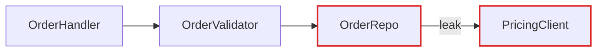
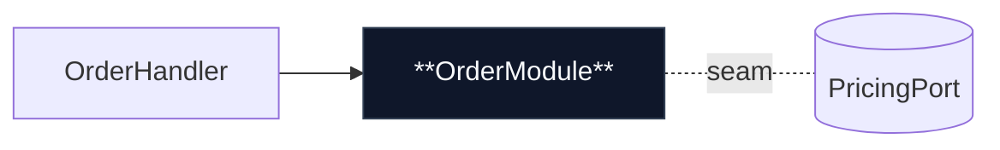
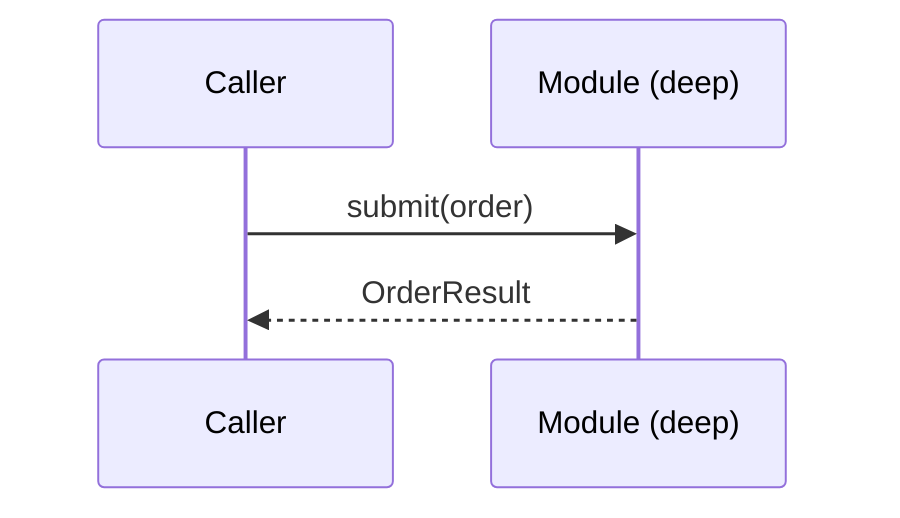

# Markdown Report Format

The architectural review is rendered as a single markdown file saved to `<repo>/.docs/architecture-review-<timestamp>.md`. The `.docs/` directory is gitignored scratch space — each run produces a fresh file. After writing, open it with `open <path>` on macOS and tell the user the absolute path.

Mermaid fenced code blocks (` ```mermaid `) handle graph-shaped diagrams and render natively in GitHub, Obsidian, VS Code, and most modern markdown viewers — no CDN required. For structural shapes Mermaid's layout fights (mass diagrams, cross-sections), use ASCII art or descriptive prose. Mix the two — don't lean on Mermaid for everything, it'll start to look generic.

## Scaffold

```markdown
# Architecture Review — {{repo name}}

_{{date}}_

**Legend:** plain box = module · dashed line = seam · `[!]` = leakage · **bold box** = deep module

---

## Candidates

### Candidate 1: {{title}}
...

### Candidate 2: {{title}}
...

---

## Top Recommendation

...
```

## Header

Repo name, date, and a compact legend: plain box = module, dashed line = seam, `[!]` marker = leakage, bold/dark label = deep module. No introduction paragraph — straight into the candidates.

## Candidate section

The diagrams carry the weight. Prose is sparse, plain, and uses the glossary terms (`Skill(craft:codebase-design)`) without ceremony.

Each candidate is one `### Candidate N: <title>` section containing:

- **Strength:** `Strong` | `Worth exploring` | `Speculative` — plus the dependency category (`in-process`, `local-substitutable`, `ports & adapters`, `mock`)
- **Files** — monospaced list of files/modules involved
- **Before / After diagram** — the centrepiece. Two sub-sections or a two-column ASCII layout. See patterns below.
- **Problem** — one sentence. What hurts.
- **Solution** — one sentence. What changes.
- **Wins** — bullets, ≤6 words each. e.g. "Tests hit one interface", "Pricing logic stops leaking", "Delete 4 shallow wrappers".
- **NDR conflict** (if applicable) — one line in a blockquote: `> **NDR conflict:** contradicts ndr:area/topic/NNNN-slug — but worth reopening because…`

No paragraphs of explanation. If the diagram needs a paragraph to be understood, redraw the diagram.

## Diagram patterns

Pick the pattern that fits the candidate. Mix them. Don't make every diagram look the same — variety is part of the point.

### Mermaid flowchart (the workhorse for dependencies / call flow)

Use a Mermaid `flowchart` or `graph` when the point is "X calls Y calls Z, and look at the mess." Style with `classDef` to mark leakage edges and the deep module. Sequence diagrams work well for "before: 6 round-trips; after: 1."

````markdown
**Before**



**After**


````

### ASCII cross-section (good for layered shallowness)

Stack horizontal bands to show layers a call passes through. Before: 6 thin layers each doing nothing. After: 1 consolidated band labelled with the unified responsibility.

```
Before                         After
┌────────────────────┐         ┌────────────────────────┐
│  RouteHandler      │         │                        │
├────────────────────┤         │   OrderModule          │
│  RequestParser     │   →→→   │   (deep)               │
├────────────────────┤         │                        │
│  Validator         │         └────────────────────────┘
├────────────────────┤
│  Repo              │
└────────────────────┘
```

### ASCII mass diagram (good for "interface as wide as implementation")

Two rectangles per module — one for interface surface area, one for implementation. Before: interface rectangle nearly as tall as the implementation (shallow). After: interface rectangle is short, implementation rectangle is tall (deep).

```
Before (shallow)               After (deep)
┌──────────────────┐           ┌──────────────────┐
│ Interface        │           │ Interface  (small)│
│ (large)          │           └──────────────────┘
│                  │           ┌──────────────────┐
└──────────────────┘           │                  │
┌──────────────────┐           │ Implementation   │
│ Implementation   │           │ (large)          │
│ (similar size)   │           │                  │
└──────────────────┘           └──────────────────┘
```

### Mermaid sequence (good for round-trip reduction)



### Call-graph collapse (good for extracted-for-testability clusters)

Before: a Mermaid graph of a scattered function-call tree. After: the same logic collapsed into one node, with internal calls shown as a nested subgraph.

## Top recommendation section

One `## Top Recommendation` section at the end. Candidate name, one sentence on why, an anchor link to the candidate heading. That's it.

## Tone

Plain English, concise — but the architectural nouns and verbs come straight from `Skill(craft:codebase-design)`. Concision is not an excuse to drift.

**Use exactly:** module, interface, implementation, depth, deep, shallow, seam, adapter, leverage, locality.

**Never substitute:** component, service, unit (for module) · API, signature (for interface) · boundary (for seam) · layer, wrapper (for module, when you mean module).

**Phrasings that fit the style:**

- "Order intake module is shallow — interface nearly matches the implementation."
- "Pricing leaks across the seam."
- "Deepen: one interface, one place to test."
- "Two adapters justify the seam: HTTP in prod, in-memory in tests."

**Wins bullets** name the gain in glossary terms: *"locality: bugs concentrate in one module"*, *"leverage: one interface, N call sites"*, *"interface shrinks; implementation absorbs the wrappers"*. Don't write *"easier to maintain"* or *"cleaner code"* — those terms aren't in the glossary and don't earn their place.

No hedging, no throat-clearing, no "it's worth noting that…". If a sentence could be a bullet, make it a bullet. If a bullet could be cut, cut it. If a term isn't in `Skill(craft:codebase-design)`'s glossary, reach for one that is before inventing a new one.
